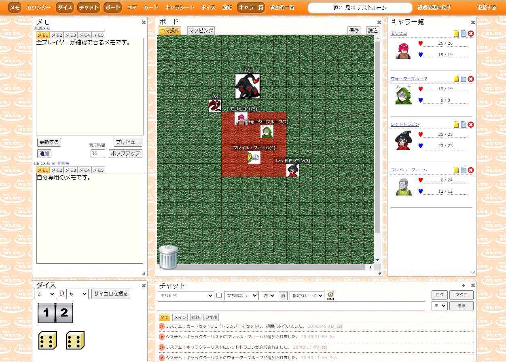

# オンセンルーム

ブラウザだけで全ての操作が可能なTRPGオンラインセッション用のチャットツールです。

## 機能

- **遊ぶ機能**

  - チャット機能、マクロ・タグ機能
  - ダイスボット（オンセンダイスボット、BCDice）
  - キャラクターシート
  - コマ、カード、共有メモ
  - マッピング機能
  - BGM再生
  - GMサポート機能（シナリオセット）
  - カウンター機能
  - ボード保存（xml形式）
  - スマホ対応
  
- **TRPGオンラインセッションSNSとの連携**

  - キャラクターデータの呼び出し
  - シナリセットの呼び出し
  - リプレイのアップロード
  
- **DISCODEとの連携**

  - DISCODEのルームを自動生成し、ボイスチャットが行える（TRPGオンラインセッションSNSからルームを作成した場合のみ）

## オンセンルームの設置

Webサーバにオンセンルームを設置して利用することができます。  

- オンセンルームの設置についてはこちら（ https://trpgsession.click/onsenroom.php ）を参照ください。

## 開発言語

PHP、JavaScript（jQuery）

## 開発寄与・バグの報告・要望について

オンセンルームの問題点の報告や機能などの要望またバグフィックスなどの開発寄与については、以下の方法があります。

- GitHubの issue/Pull Request を作成。
- TRPGオンラインセッションSNSのトピックにある要望・不具合（ https://trpgsession.click/topic-list.php ）に投稿。
- Eメール（ trpg_session@yahoo.co.jp ）に送信。
- Twitter（ https://twitter.com/ponta_banto ）に送信。

## 変更履歴

- [ChangeLog](https://github.com/ponta0321/OnsenRoom/blob/master/CHANGELOG.md)